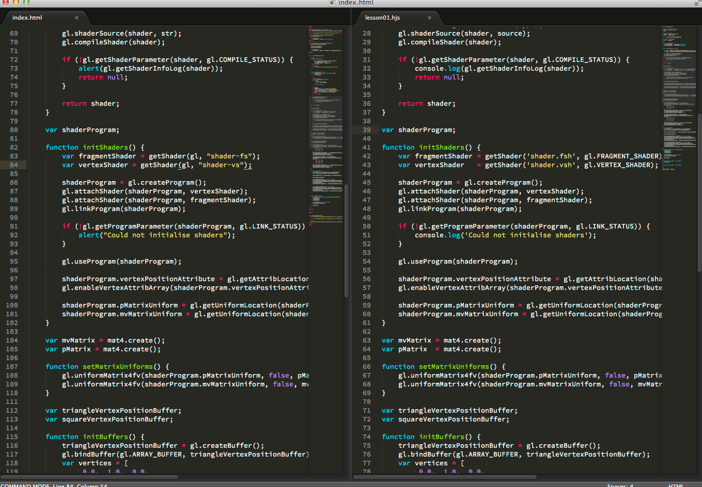

# WebGL Porting Lessons

## What is it?

This example contains a set of lessons that ports [webgl-lessons](http://learningwebgl.com/blog/?page_id=1217) to hyperloop with simple WebGL wrapper, to demonstrate how easy it is to port your WebGL project onto hyperloop.
 


## Do you mean Hyperloop supports WebGL?

No. The WebGL wrapper in this example is not aiming perfect compatibility with WebGL. This example demonstrates how to write a wrapper around OpenGL ES 2.0 to help porting your WebGL project onto hyperloop.

## What does it look like?

Some of WebGL-wrapper code looks just like WebGL.



## How to wrap WebGL-like operations?

See [webgl.hjs](./lesson01/webgl.hjs). Some of functions just wraps OpenGL ES 2.0 function, and others may need byte array operations using @memory annotation.

```javascript
GL.prototype.enableVertexAttribArray = function(index) {
    glEnableVertexAttribArray(index);
};
GL.prototype.vertexAttribPointer = function(index,size,type,normalized,stride,data) {
    glVertexAttribPointer(index,size,type,this.toGLBool(normalized),stride,data);
};
GL.prototype.uniformMatrix4fv = function(location,transpose,v) {
    var data = @memory();
    data.putFloat(v);
    glUniformMatrix4fv(location._,v.length/16,this.toGLBool(transpose),data);
};
```

## Legal

All lessons are originally come from [webgl-lessons](https://github.com/tparisi/webgl-lessons) which is released under New BSD License. You can find tutorial articles from [http://learningwebgl.com/lessons/](http://learningwebgl.com/lessons/).

Copyright (c) 2013 by [Appcelerator, Inc](http://www.appcelerator.com). All Rights Reserved.
This code contains patents and/or patents pending by Appcelerator, Inc.
Hyperloop is a trademark of Appcelerator, Inc.
This project is licensed under the Apache Public License, version 2.  Please see details in the LICENSE file.
